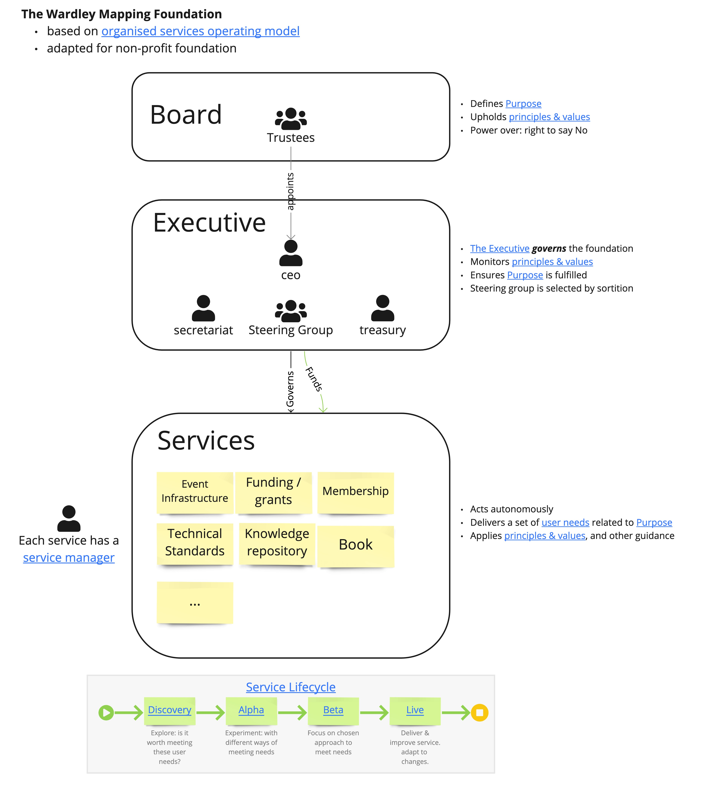

# Wardley Mapping Foundation
Welcome to the Wardley Mapping Foundation, a community-driven organisation created to educate the public on the mapping of competitive landscapes.

This repository contains the Foundation's [purpose](Purpose.md), principles and operating model.  Separate repositories will be created for various initiatives the Foundation supports.

All material is released under [CC-by-SA v4.0](https://creativecommons.org/licenses/by-sa/4.0/).
